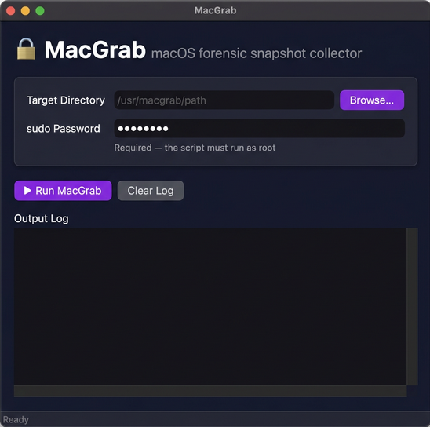
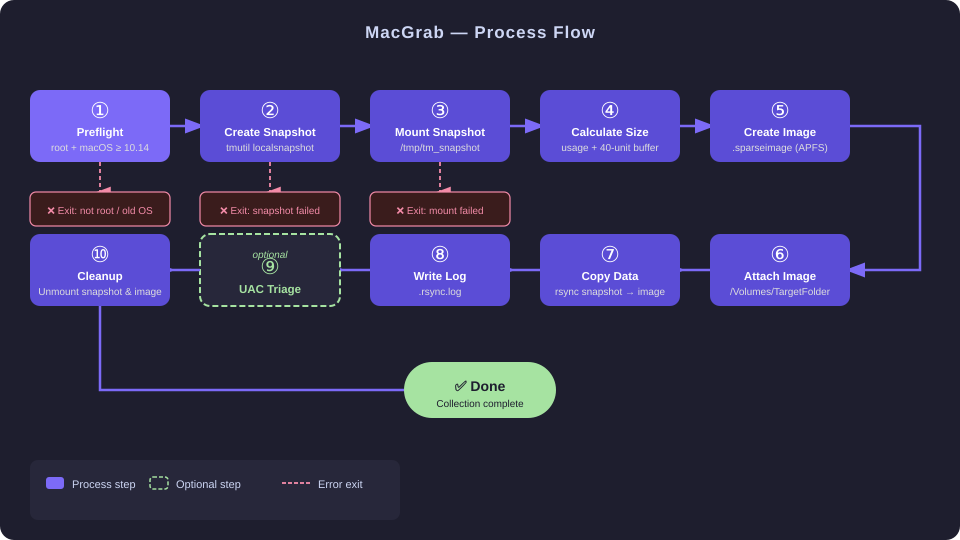

# MacGrab

A macOS Bash script for forensic data collection. It creates a local Time Machine snapshot, mounts it read-only, and copies all data into a self-sizing container (APFS sparse image by default). This can be on an mounted external or internal drive.

The bash script lives off the land. No third-party tools required for a simple snapshot collection.

---

## Requirements

| Requirement | Details |
|---|---|
| **macOS** | 10.14 (Mojave) or later |
| **Shell** | Bash (built-in) |
| **Privileges** | Must be run as **root** (`sudo`) |
| **Full Disk Access** | `Terminal.app` must have Full Disk Access enabled in **System Settings → Privacy & Security → Full Disk Access** |
| **Time Machine** | Local snapshots must be enabled and supported on the system volume |

> **Note:** ASR (Apple Software Restore) can be used as an alternative if SIP is disabled.

---

## GUI (MacGrabGUI.py)

A simple point-and-click front-end is included so you don't need to use the terminal.



**Additional requirement:** Python 3 (ships with macOS — no install needed)

**Launch:**
```bash
python3 MacGrabGUI.py
```

**Features:**
- **Browse** button to pick the target directory
- **sudo Password** field (required — the script runs as root)
- **Run / Stop** button to start or cancel the collection
- **Live colour-coded log** — errors in red, success in green, warnings in yellow
- **Status bar** showing current state

> Both `MacGrabGUI.py` and `MacGrab.sh` must be in the same folder.

---

## What It Does

1. **Creates a local Time Machine snapshot** of the root volume using `tmutil localsnapshot`
2. **Mounts the snapshot** read-only at `/tmp/tm_snapshot` using `mount_apfs`
3. **Calculates required storage** by checking the snapshot's current disk usage and adding a 40-unit buffer
4. **Creates a sparse APFS image** (`.sparseimage`) at your specified target location, sized dynamically to fit the data
5. **Copies all snapshot data** into the mounted sparse image using `rsync` with full attribute preservation
6. **Logs the transfer** to a `.rsync.log` file alongside the sparse image
7. **Cleans up** by unmounting both the snapshot and the sparse image when complete




---

## Usage

```bash
sudo sh ./MacGrab.sh <target_directory>
```

**Example:**
```bash
sudo sh ./MacGrab.sh /Volumes/ExternalDrive
```

### Output

| File | Location |
|---|---|
| Sparse image | `<target_directory>/<hostname>-targetcontainer.sparseimage` |
| rsync log | `<target_directory>/<hostname>-targetcontainer.sparseimage.rsync.log` |
| Data mount point | `/Volumes/TargetFolder` (mounted during transfer, unmounted on completion) |

---

## Configuration

A few variables at the top of the script can be adjusted to suit your environment:

| Variable | Default | Description |
|---|---|---|
| `OUT_DIR` | `/Volumes/TargetFolder` | Mount point for the sparse image during transfer |
| `mount_point` | `/tmp/tm_snapshot` | Temporary mount point for the Time Machine snapshot |
| `TARGET_CONTAINER` | `<hostname>-targetcontainer.sparseimage` | Name of the output sparse image |

---

## Optional: Triage - Run UAC to collect artifacts from the Snapshot

The script includes a commented-out section to run [UAC (Unix Artifact Collector)](https://github.com/tclahr/uac) directly against the mounted snapshot. To enable it, uncomment and update the path in the script:

```bash
cd /<path_to_uac>/uac-2.9.1/
./uac -p full -a \!live_response/\* /tmp --mount-point /tmp/tm_snapshot --operating-system macos
```

---

## Troubleshooting

- **"This script must be run as root"** → Run with `sudo`
- **"Failed to create Time Machine snapshot"** → Ensure local snapshots are not disabled (`tmutil disablelocal`)
- **"Failed to mount snapshot"** → Verify Terminal has Full Disk Access in System Settings
- **Sparse image already exists** → The script will automatically delete and recreate it
